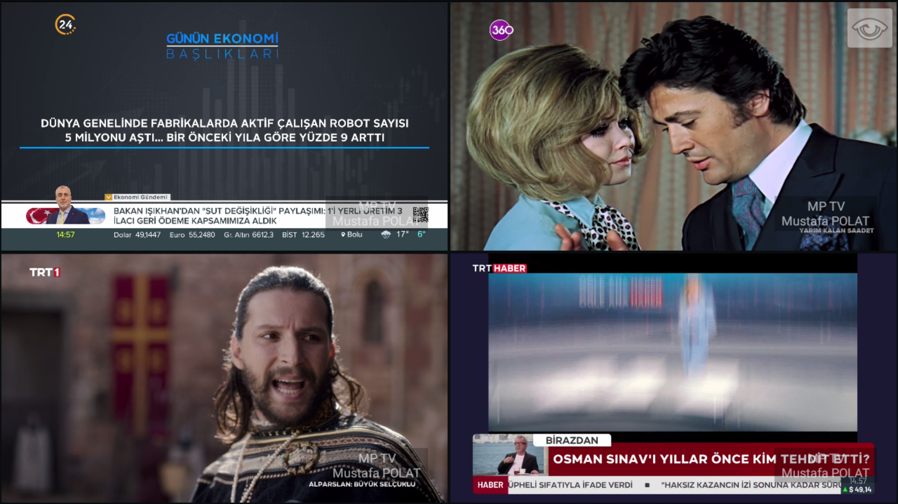
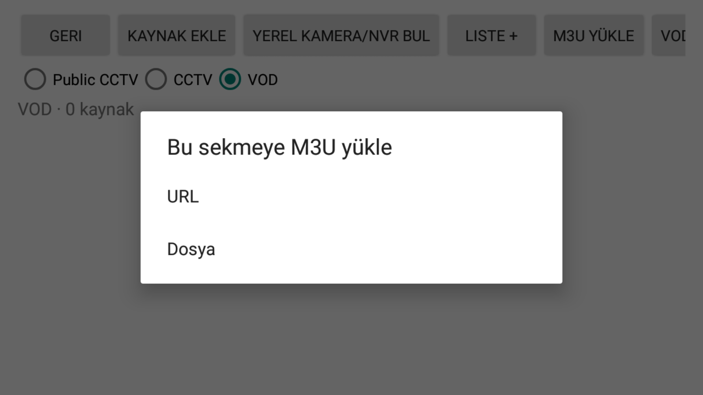
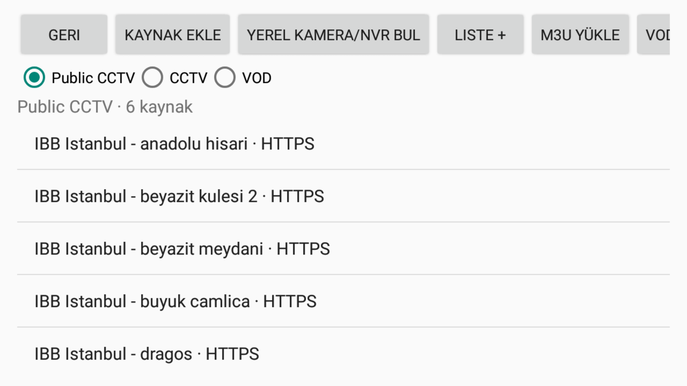
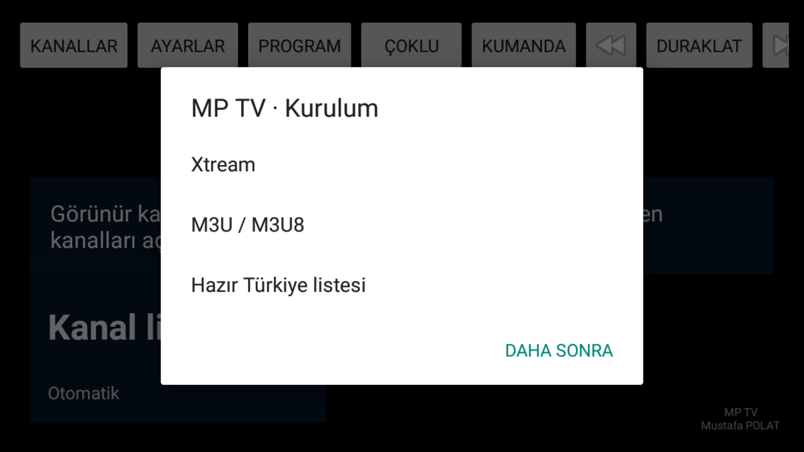

  

# MP TV

**Android için TV, IPTV, VOD ve IP kamera izleyicisi. Farklı kaynakları tek uygulamada, tekli veya çoklu görüntü düzeninde izleyin.**

MP TV; M3U/M3U8 kanal listelerini, Xtream canlı yayınlarını, XMLTV program rehberini, kamuya açık şehir kameralarını ve erişim yetkiniz olan RTSP/ONVIF kamera kaynaklarını bir araya getirir. Android TV veya TV kutunuzu televizyon izlemek, kamera/NVR canlı görüntülerini takip etmek ve birden fazla yayını birlikte göstermek için kullanabilirsiniz.

  
  
  
  

**[APK indir](https://github.com/neoxmp/mp-tv-releases/releases/latest)** · **[Sürüm notları](https://github.com/neoxmp/mp-tv-releases/releases)** · **[Hazır listeler](#hazır-tv-ve-şehir-kamerası-listeleri)** · **[Kurulum](#kurulum-ve-ilk-açılış)** · **[Kumanda](#kumanda-ve-oynatma-kontrolleri)**

*Gerçek uygulama ekranı: dört TV kaynağı, kontroller gizlenmiş görünüm ve her bölmede MP TV filigranı. Yayın görüntüleri ve kanal markaları ilgili hak sahiplerine aittir.*

> **Mevcut kullanıcılar:** 2.0.0/2.0.1'den ilk geçişte APK'yı indirip mevcut uygulamanın üzerine kurun; uygulamayı kaldırmayın. Eski sürümün imza okuma hatası Android 9 ve 10 testlerinde güncellemeyi reddetmiştir. Düzeltme 2.0.2'ye dahildir. [Güncelleme bilgileri](#uygulama-güncellemeleri).

## İçindekiler

[Ürün Özeti](#ürün-özeti) · [Kullanım Alanları](#kullanım-alanları) · [Teknik Özellikler](#teknik-özellikler) · [TV / IPTV](#tv-ve-iptv) · [VOD](#vod-ve-video-listeleri) · [EPG](#epg--program-rehberi) · [Kamera / NVR](#ip-kamera-onvif-ve-nvr) · [Çoklu Görüntü](#çoklu-görüntü-ve-görüntü-duvarı) · [Listeler](#listeler-ve-favoriler) · [Kumanda](#kumanda-ve-oynatma-kontrolleri) · [Gereksinimler](#sistem-gereksinimleri-ve-kapasite) · [SSS](#sık-sorulan-sorular)

## Ürün Özeti

| Yetenek | MP TV ile yapabilecekleriniz |
| --- | --- |
| TV / IPTV | M3U/M3U8 dosyası veya URL'sinden kanal listesi yükleme; Xtream hesabıyla canlı yayın listesi alma |
| VOD | Film/video bağlantılarını ayrı listede tutma; desteklenen içerikte duraklatma ve sarma |
| EPG | XMLTV ve gzip sıkıştırılmış XMLTV ile mevcut/sıradaki programın adı, saatleri ve açıklaması |
| ONVIF keşif | Yerel kamera/NVR arama; IP veya servis adresiyle elle bağlantı; H.264 profil seçimi |
| Main / sub stream | Kamera için ana ve alt akış tanımlama; farklı izleme düzenlerinde uygun akışı seçme |
| Görüntü duvarı | 1–32 bölme ve 1–8 sütun; TV ve kamera kaynaklarını aynı düzende birleştirme |
| Ortak favoriler | TV, Public CCTV, CCTV, VOD ve özel listelerden kaynakları ortak favorilerde toplama |
| Kanal yönetimi | TV kanallarının sırasını/adını değiştirme, gizleme ve geri getirme |
| Sağlık kontrolü | Art arda erişilemeyen canlı TV kaynaklarını otomatik gizleme; sonraki kontrollerle geri getirme |
| Kumanda | OK, yön, kanal/ses, INFO, GUIDE ve desteklenen medya tuşlarıyla kullanım |
| Hazır listeler | GitHub'dan yenilenen TV ve Public CCTV listeleri; ayrı ayrı kapatma |
| Güncellemeler | Uygulamadan yeni APK kontrolü, bütünlük/imza doğrulaması ve Android onayıyla kurulum |

## Kullanım Alanları

### Evde TV ve Kişisel Medya

Android TV veya TV kutusunda günlük kanal izleme, aileye özel favoriler, program bilgisi ve kişisel VOD listeleri için kullanılabilir. Birden fazla haber, spor veya diğer TV kanalını aynı düzene yerleştirerek yayınları birlikte takip edebilirsiniz. Kullanılan yayınlara erişim hakkınızın olması gerekir.

### İşletme, Ofis ve Resepsiyon

Bir Android ekranı veya TV kutusunu TV yayınları ve işletmenize ait kamera görüntüleri için ortak izleme ekranı olarak kullanabilirsiniz. Kamera noktaları veya kullanım amaçları özel listelere ayrılabilir. MP TV, zamanlanmış dijital tabela içerik yönetim sistemi değildir.

### Kamera/NVR için Ek Canlı Görüntü Ekranı

NVR veya IP kameranın erişilebilir RTSP akışını Android cihazda görüntüleyerek ek bir izleme noktası oluşturabilirsiniz. Tekli görünümde ana akış, çoklu düzende düşük bant genişlikli alt akış kullanılabilir. Uygulama NVR'nin kayıt, arşiv, alarm ve yönetim işlevlerinin yerini almaz.

### Atölye, Depo, Şantiye ve Tesis

Erişim yetkiniz olan giriş, üretim, depo veya saha kameralarını konuma göre gruplayın; sık izlediğiniz noktaları favorilerde birleştirin. Çoklu görünüm, birkaç kaynağı aynı anda gözle takip etmeye yardımcı olur. Kritik güvenlik alarmı, olay tespiti, kayıt veya kesintisiz gözetim garantisi sunulmaz.

### Şehir ve Turistik Kameralar

Public CCTV bölümünde kamuya açık şehir görüntülerini izleyebilir, kendi doğrulanmış bağlantılarınızı ekleyebilirsiniz. Hazır listede IBB'nin kamuya açık turistik kameralarından seçilmiş kaynaklar vardır. Trafik denetim sistemlerine veya kurumların kapalı kamera ağlarına erişim sağlanmaz.

## Teknik Özellikler

| Başlık | Destek / kapsam |
| --- | --- |
| Platform | Android TV, TV kutusu ve uygun Android cihazlar |
| Asgari Android | Android 6.0 / API 23 |
| Güncel sürüm | 2.0.2 / sürüm kodu 22 |
| Paket | `com.mpolat.mptv` |
| Dağıtım | GitHub Releases üzerinden imzalı APK |
| Arayüz | Türkçe, yatay ekran; kumanda/yön tuşları ve dokunmatik kullanım |
| Kanal listesi | M3U / M3U8; HTTP(S) URL veya yerel dosya |
| M3U boyut sınırı | İçe aktarmada en fazla 32 MB |
| Xtream | Sunucu + kullanıcı adı + parola; canlı yayın M3U listesi ve XMLTV bağlantısı |
| Video | Oynatıcının desteklediği HTTP(S) video, HLS ve RTSP kaynakları |
| VOD | M3U video bağlantıları; ayrı bölüm; içerik sonunda sürekli tekrar yok |
| EPG | XMLTV / gzip XMLTV; mevcut ve sıradaki program |
| Görüntü düzeni | 1–32 bölme; 1–8 sütun |
| Aktif yayın sınırı | Bölme sayısından bağımsız ayarlanabilir; cihaz kapasitesine bağlı |
| Kapasite önerisi | Bellek sınıfı ve H.264 donanım çözücü kapasitesine göre 1–4 aktif yayın |
| Kamera akışı | Main + isteğe bağlı sub stream |
| ONVIF | Yerel keşif, elle servis adresi, H.264 profil seçimi ve RTSP URI alma |
| RTSP taşıma | TCP |
| Kalite seçenekleri | Otomatik, 1080p, 720p, 480p, 360p, Stabilite |
| Özel kaynak kapasitesi | Public CCTV, CCTV, VOD ve özel listelerde toplam en fazla 20.000 kaynak |
| Favoriler | Farklı listelerden ortak favoriler |
| TV kanal düzeni | Sıra, ad, gizleme, geri getirme ve düzeni sıfırlama |
| Medya kontrolleri | Oynat/duraklat; sarılabilir kaynaklarda ±10 saniye |
| APK doğrulama | Paket, sürüm, boyut, SHA-256 ve mevcut kurulumla imza eşleşmesi |

**Çözünürlük seçenekleri kalite üst sınırıdır.** Kaynakta olmayan çözünürlük üretilmez; 480p yayın 1080p ayrıntıya dönüştürülmez. Uyumluluk codec, cihaz, yayın biçimi ve ağ bağlantısına bağlıdır.

## TV ve IPTV

### M3U / M3U8

HTTP/HTTPS liste adresinden veya Android dosya seçicisiyle cihazdaki M3U/M3U8 dosyasından kanal yüklenebilir. İçe aktarmada **mevcut listeye ekleme** veya **mevcut listeyi değiştirme** seçilir. Kanal adı, logo, grup ve `tvg-id` içeren kayıtlar kullanılabilir.

Kanalları arayabilir, numarayla seçebilir, favorilere ekleyebilir, yeniden sıralayabilir ve görünen adlarını değiştirebilirsiniz. İstenmeyen kanalları gizlemek, daha sonra geri getirmek ve TV listesini tamamen temizlemek mümkündür. Başarısız liste içe aktarmada mevcut kaynaklar korunur.

### Xtream Hesabı

Sunucu adresi, kullanıcı adı ve parola ile canlı yayın listesi alınır. Sunucu adresine varsa port eklenir; giriş ekranına tam `get.php` bağlantısı yerine temel sunucu adresi yazılır. Uygun Xtream listelerinde hesabın XMLTV rehber bağlantısı da kullanılır.

**Kapsam:** Xtream canlı yayın erişimi vardır. Film/dizi/sezon kataloğu, afişli içerik mağazası, catch-up arşivi veya sağlayıcının tüm yönetim API'leri sunulmaz. VOD bağlantıları ayrı M3U listesiyle eklenebilir.

### Kalite ve Yayın Devamlılığı

Otomatik kalite ve Stabilite seçenekleri, desteklenen çok kaliteli yayınlarda takılma durumunda çözünürlük üst sınırını düşürebilir. Yayın kararlı hale geldiğinde otomatik mod daha yüksek kaliteye yeniden izin verebilir. Oynatma hatalarında sınırlı yeniden deneme ve elle **Yeniden dene** seçeneği bulunur. Sunucu kesintisi, erişim kısıtı veya desteklenmeyen codec uygulama tarafından giderilemez.

### Kanal Sağlık Kontrolü

Otomatik kontrol ayarlardan açılıp kapatılabilir; **Şimdi kontrol et** ile elle başlatılabilir. Üç ardışık başarısız kontrol sonrası canlı TV kanalı otomatik gizlenebilir. Sonraki kontrollerde erişim sağlanırsa otomatik gizlenen kanal dönebilir; tek geçici hata hemen gizleme yapmaz.

Elle gizleme ayrı yönetilir. **Gizlenen kanallar** ekranından seçilenleri veya hepsini gösterin. VOD kaynakları canlı TV sağlık kontrolüne dahil değildir. Kontrol zamanı Android'in arka plan çalışma koşullarına bağlıdır; erişim kontrolü kesintisiz oynatma garantisi değildir.

## VOD ve Video Listeleri

Film/video bağlantıları canlı TV'den ayrı VOD bölümünde tutulur. URL veya yerel M3U dosyasıyla yüklenebilir; listeye ekleme veya VOD listesinin kaynaklarını değiştirme seçilebilir.

1. **Ayarlar → Kamera / şehir / özel kaynaklar** ekranını açın.
2. **VOD listesi ekle** seçeneğini kullanın.
3. **URL** veya **Dosya** kaynağını seçin.
4. Ekleme/değiştirme tercihini yapın.
5. İzleme ekranındaki **VOD** bölümünden kaynağı açın; dilerseniz favorilere ekleyin.

Desteklenen HTTP(S) video ve HLS kaynakları oynatılabilir. Oynat/duraklat kullanılabilir; sarma yalnızca kaynak izin veriyorsa çalışır. Video sona erdiğinde sürekli tekrar oynatılmaz.

**Yerel dosya seçimi M3U liste dosyası içindir.** Herhangi bir yerel video dosyasını doğrudan açma, DRM servis hesabıyla giriş veya Xtream film/dizi kataloğu bu özelliğin kapsamında değildir.

## EPG / Program Rehberi

XMLTV rehberinden **mevcut** ve **sıradaki** program gösterilir. Veride bulunuyorsa program adı, başlangıç/bitiş saati ve açıklaması görüntülenir. Gzip sıkıştırılmış rehberler de desteklenir.

- **Program** veya **GUIDE** ile program bilgisini açın.
- **Ayarlar → EPG kaynağı** üzerinden HTTP(S) XMLTV adresinizi girin.
- **Otomatik** ile liste/hesap için otomatik seçilen rehber adresine dönün.
- Program ekranından rehberi yeniden güncelleyin.

Kanal kimliklerinin rehberle eşleşmesi ve program tarihlerinin güncel olması gerekir. XML/XML.GZ dosyasının açılması tek başına yeterli değildir. Kanal eşleşmediğinde, rehber eski olduğunda veya o saate ait program bulunmadığında uygulama durumu bildirir. Her hazır TV kaynağı için eksiksiz EPG garantisi yoktur.

## IP Kamera, ONVIF ve NVR

### Bağımsız Kamera Kaynağı

Kamera veya NVR'nin canlı RTSP/HTTP(S) bağlantısını doğrudan ekleyin. Kaynağa ad verin, ana akış adresini ve isteğe bağlı alt akışı girin. RTSP için kullanıcı adı/parola alanları vardır. Kaynak CCTV veya kullanıcının oluşturduğu özel listede tutulabilir.

NVR kanalının RTSP adresi üretici ve yapılandırmaya göre değişir. MP TV erişilebilir canlı akışı **viewer** olarak gösterir; NVR'yi yönetmez, kayıt başlatmaz ve kayıt arşivini açmaz.

### Yerel ONVIF Kamera / NVR Bulma

1. **Kaynaklar → Yerel kamera/NVR bul** ekranını açın.
2. **Yerel ağı tara** ile keşfi başlatın; tarama yaklaşık sekiz saniye sürer.
3. Cihazı seçin veya **IP / ONVIF adresi** ile elle bağlanın.
4. Cihazın yetkili ONVIF hesabını girin.
5. H.264 profillerinden main ve isteğe bağlı sub profil seçin.
6. Kaynağı seçili listeye ekleyin.

NVR profilleri farklı kamera kanallarını temsil edebilir; aynı kameranın main/sub profillerini eşleştirin. Cihazda ONVIF ve RTSP etkin, hesap yetkili ve cihaz saati doğru olmalıdır.

Keşif aynı ağda multicast iletişimi gerektirir. Misafir Wi-Fi izolasyonu, VLAN, VPN, güvenlik duvarı ve emülatör NAT'ı keşfi engelleyebilir. Bu durumda IP/servis adresiyle bağlantı denenebilir.

### Main / Sub Stream

| Akış | Kullanım |
| --- | --- |
| Main | Tek kamerayı daha fazla ayrıntıyla izleme; çözünürlük/bitrate kameranın ana akışına bağlıdır. |
| Sub | Çoklu görüntüde daha düşük ağ/çözücü yükü; kalite kameranın alt akış ayarına bağlıdır. |

Ana/alt akışlar ayrı tanımlanır; tekli izleme için akış değiştirilebilir ve çoklu düzende alt akıştan yararlanılır. Alt akış kullanmak cihaz kapasitesini sınırsız hale getirmez.

### Uyumluluk

RTSP, TCP üzerinden oynatılır. H.264 tercih edilmelidir; **H.265 RTSP uyumluluğu varsayılmamalıdır**. ONVIF ile cihazın bulunması her video profilinin oynatılacağı anlamına gelmez. [Android Media3 RTSP kapsamı](https://developer.android.com/media/media3/exoplayer/rtsp).

Keşif ekranı ve Media1 profil/RTSP alışverişi test edilmiştir; gerçek kamera/NVR donanımıyla marka-model saha doğrulaması henüz yapılmamıştır. PTZ, kayıt arşivi, alarm ve uzaktan cihaz yapılandırması bu sürümde bulunmaz.

## Çoklu Görüntü ve Görüntü Duvarı

**TV, şehir kamerası ve kişisel kamera kaynakları aynı düzende birlikte kullanılabilir.** Her bölmeye istediğiniz kaynağı atayın.

| Kontrol | İşlev |
| --- | --- |
| Bölümleme | 1–32 bölme, 1–8 sütun ve aktif yayın sınırı |
| Kaynak seçimi | Bölmede gösterilecek kaynağı listelerden seçme |
| Tek bölmeyi büyütme | Kaynağı öne çıkarıp çoklu düzene dönme |
| Kontrolleri gizle | Üst menü ve bölme başlıkları olmadan bütün düzeni izleme |
| Kontrolleri geri getir | Geri/Menu veya ekrandaki görünüm düğmesi |
| Ses | Seçilen bir bölmeden ses alma veya sessize geçme |
| Duraklat / oynat | Aktif oynatıcıları birlikte duraklatma/sürdürme |
| Filigran | Her bölmede MP TV / Mustafa POLAT |

**32 bölme, her cihazda 32 eşzamanlı akış garantisi değildir.** Bölme düzeni ve aktif sınır ayrı ayarlanır. Sınır aşıldığında eski bir görüntünün bağlantısı kapatılabilir. Dörtten veya cihaz önerisinden fazla aktif yayında kapasite uyarısı gösterilir.

Başlangıç için 2×2 düzen ve dört ya da cihazın önerdiği daha az aktif yayın kullanın. Daha fazla kamera için sub stream, düşük çözünürlük/bitrate ve kablolu ağ tercih edin. Isınma, akıcılık ve ağ kullanımını gözlemleyerek artırın.

## Listeler ve Favoriler

| Bölüm | İçerik |
| --- | --- |
| TV | Canlı televizyon / IPTV |
| Public CCTV | Hazır veya sizin eklediğiniz kamuya açık kameralar |
| CCTV | Kişisel kamera ve NVR canlı görüntüleri |
| VOD | Film/video bağlantı listeleri |
| Özel listeler | Kullanıcının adlandırdığı kaynak grupları |
| Favoriler | Farklı bölümlerden ortak kaynaklar |

Özel listeleri **Ofis**, **Depo**, **Girişler**, **Şehirler** veya **Kişisel Videolar** gibi adlandırabilirsiniz. Kaynak ekleme/düzenleme/silme, M3U yükleme ve listeye ekleme/değiştirme seçenekleri vardır. Özel listeler silinebilir; yerleşik sekmelerin kendisi silinmez.

TV düzenleyicisinde kanalları yukarı/aşağı taşıyabilir, adını değiştirebilir, gizleyebilir ve düzeni sıfırlayabilirsiniz. TV, kamera ve VOD kaynakları aynı ortak favorilerde yer alabilir.

## Kumanda ve Oynatma Kontrolleri

| Tuş | Normal izleme ekranındaki işlev |
| --- | --- |
| OK / Enter | İzleme menüsünü açma; menüde odaktaki seçeneği çalıştırma |
| Yön tuşları | Açık menü/panellerde gezinme |
| Sağ / sol | İzleme menüsünü açma; ses değiştirmez |
| Yukarı / CH+ | Sonraki kanal |
| Aşağı / CH− | Önceki kanal |
| 0–9 | Kanal numarası; OK ile onay |
| Ses + / Ses − / Mute | Android yayın sesini yönetme |
| INFO | Kanal bilgisi |
| GUIDE | Program rehberi |
| Menü / Settings | Ayarlar |
| HELP | Kumanda yardımı |
| Play / Pause | Oynatma / duraklatma |
| İleri / geri sar | Sarılabilir kaynakta 10 saniyelik adımlar |
| Next / Previous | Kanal değiştirme |
| Geri | Açık menüyü kapatma; çoklu görünümde gizlenmiş kontrolleri geri getirme |

Kumandanın Android'e ilettiği tuş kodları kullanılabilir işlevleri etkiler. INFO/GUIDE veya medya tuşu yoksa ekrandaki **Program**, **Kumanda**, **Duraklat** ve sarma kontrollerini kullanabilirsiniz.

**Canlı pause kalıcı DVR değildir.** Uzun duraklamadan sonra canlı noktaya dönülebilir. Kaynak sarılabilir değilse ileri/geri sarma yapılamaz; uygulama desteklenmediğini bildirir.

## Hazır TV ve Şehir Kamerası Listeleri

| Liste | Doğrudan M3U |
| --- | --- |
| TV | [tv.m3u](https://raw.githubusercontent.com/neoxmp/mp-tv-releases/main/playlists/tv.m3u) |
| Public CCTV | [public-cctv.m3u](https://raw.githubusercontent.com/neoxmp/mp-tv-releases/main/playlists/public-cctv.m3u) |

Hazır listeler GitHub'dan yenilenir. Liste kaynağına ulaşılamadığında son/gömülü liste kullanılabilir; video oynatmak için yayın sunucusuna erişim yine gereklidir.

Ayarlardan ayrı ayrı yönetilir:

- **Hazır TV listesini göster**
- **Hazır Public CCTV listesini göster**
- **Listeleri otomatik güncelle**

Hazır listeyi kapatmak kendi kaynaklarınızı silmez; kapatılan liste otomatik yeniden açılmaz. GitHub'daki M3U değişikliği için yeni APK gerekmez. Arka plan yenilemesinin kesin zamanı Android tarafından belirlenir.

### Hazır İçeriğin Kapsamı

TV listesi [iptv-org/iptv](https://github.com/iptv-org/iptv) içindeki kamuya açık adreslerin kontrol edilebilen bir alt kümesidir; tüm Türkiye kanalları veya her kanalda EPG eşleşmesi iddiası yoktur.

2 Ekim 2026 kontrolünde Public CCTV listesine IBB'nin resmi turistik kaynaklarından altı yayın eklenmiştir: **Anadolu Hisarı, Beyazıt Kulesi 2, Beyazıt Meydanı, Büyük Çamlıca, Dragos ve Eminönü**. Manifest ve video parçası erişimleri [doğrulama kaydında](playlists/verification.json) bulunur. Kaynak: [IBB İstanbul'u Seyret](https://istanbuluseyret.ibb.istanbul/tr/turistik-kameralar).

Bunlar trafik denetim kameraları değildir. KGM, valilik veya kaymakamlık adıyla doğrulanmamış yayın eklenmemiştir. Yayınlar değişebilir/kapanabilir. Kamuya açık olmak yeniden dağıtım hakkı sağlamaz; görüntü ilgili sağlayıcıdan alınır ve sağlayıcının koşulları geçerlidir.

## Ekran Görünümleri

### İlk Açılış

Xtream, M3U/M3U8 veya hazır Türkiye listesiyle başlayın. Kaynak seçimi sonradan ayarlardan değiştirilebilir.

### Kamera ve VOD Yönetimi

[Kaynak yönetimi](assets/source-manager.png) · [VOD liste içe aktarma](assets/vod-import.png) · [Tam ekran çoklu izleme](assets/multiview-fullscreen.png)

*Ekranlar gerçek uygulama görüntüleridir. Cihaz/Android sürümü ve içerik görünümü etkiler. Örnek yayınlar bir abonelik veya yeniden yayın hakkı olarak sunulmaz.*

## Sistem Gereksinimleri ve Kapasite

| Konu | Gereksinim / kullanım notu |
| --- | --- |
| İşletim sistemi | Android 6.0 veya üzeri |
| Cihaz | Uyumlu Android TV, TV kutusu veya Android cihaz; yatay arayüz |
| Giriş | Android yön/OK tuşları gönderen kumanda, klavye veya dokunmatik |
| Ağ | TV/video sunucusuna veya kamera/NVR ağına erişim |
| ONVIF keşif | Aynı ağda multicast; ONVIF etkin ve yetkili hesap |
| Video | Desteklenen codec/biçim; RTSP için H.264 tercih edin |
| Alan | APK yaklaşık 8 MB; kurulum, veri ve güncelleme için ek boş alan gerekir |
| Çoklu izleme | Akış sayısı, çözünürlük, bitrate, bellek, çözücü ve ağ kapasitesine bağlı |
| İnternetsiz yerel izleme | Ulaşılabilir yerel kamera/NVR kaynakları; internet TV, uzak EPG ve GitHub için bağlantı gerekir |

Sabit RAM miktarı bütün cihazlarda aynı yayın sayısını garanti etmez. Cihaz önerisi bir performans sertifikası değildir. Çoklu görüntü için düşük bitrate/sub stream ve mümkünse kablolu ağ kullanın.

## Kurulum ve İlk Açılış

1. [Son sürümden](https://github.com/neoxmp/mp-tv-releases/releases/latest) APK'yı indirin.
2. Android cihazda açın; gerekirse APK'yı açan uygulamaya **bu kaynaktan kurulum** izni verin.
3. MP TV'yi başlatın.
4. **Xtream**, **M3U / M3U8** veya **Hazır Türkiye listesi** seçin.
5. Listeye ekleme/değiştirme tercihini yapıp kaynakları yükleyin.
6. Kamera/VOD için **Ayarlar → Kamera / şehir / özel kaynaklar** ekranını kullanın.
7. Favori düzenini ve çoklu görünümde aktif yayın sınırını ayarlayın.

**BlueStacks:** APK'yı pencereye sürükleyip bırakın veya **APK yükle** kullanın. Emülatör NAT'ı ONVIF multicast keşfini engelleyebilir; elle IP bağlantısında da cihazın ağdan erişilebilir olması gerekir.

## Uygulama Güncellemeleri

**Ayarlar → Uygulama güncellemeleri** ile yeni sürüm kontrol edilir. Açılışta kontrol açılıp kapatılabilir. APK indirilir, bütünlük ve imza doğrulanır, Android kurulum onayı istenir. Sessiz kurulum yoktur.

Aynı paket/imzayla mevcut uygulamanın üzerine kurulum listeleri ve ayarları korur. Uygulamayı kaldırmak veya verilerini temizlemek bu verileri silebilir.

**2.0.0/2.0.1 ilk geçişi:** [GitHub'dan](https://github.com/neoxmp/mp-tv-releases/releases/latest) APK'yı indirip elle üzerine kurun. Eski imza okuma uyumsuzluğu 2.0.2'de düzeltildi.

**Liste ve APK güncellemesi ayrıdır:** M3U içerikleri APK kurulmadan yenilenebilir; yeni uygulama özellikleri için yeni APK gerekir.

## Sık Sorulan Sorular

<strong>MP TV bir yayın aboneliği mi?</strong>

Hayır. Bir oynatıcı/izleyicidir. Kendi erişim hakkınız olan yayınları ve kamuya açık kaynakları kullanırsınız; ücretli servislere yetkisiz erişim sağlamaz.

<strong>32 kamerayı aynı anda açabilir miyim?</strong>

32 bölmeli düzen oluşturulabilir; 32 eşzamanlı akış garantisi yoktur. Aktif sınır, sub stream, bitrate ve cihazın çözücü/ağ kapasitesi belirleyicidir. Az sayıda yayınla başlayın.

<strong>NVR kayıtlarını, PTZ'yi veya alarmları yönetebilir miyim?</strong>

Hayır. Canlı akış izleme ve ONVIF keşif/profil/RTSP adresi alma vardır. Kayıt arşivi, PTZ, alarm ve cihaz yönetimi yoktur.

<strong>Kamera bulunmuyor veya görüntü açılmıyor. Ne yapmalıyım?</strong>

Ağ, ONVIF/RTSP, hesap yetkisi, cihaz saati ve multicast engellerini kontrol edin. IP/servis adresiyle deneyin. H.264 profil kullanın; H.265 RTSP'yi varsaymayın. Keşif ve video oynatma ayrı aşamalardır.

<strong>EPG açılıyor ama program görünmüyor. Neden?</strong>

Kanal kimliği/adı rehberle eşleşmeli ve rehber güncel program kayıtları içermelidir. Boş, eski tarihli veya farklı kanal kimlikleri kullanan veriler program göstermez.

<strong>Gizlenen kanalları nasıl geri getiririm?</strong>

Gizlenen kanallar ekranından seçilenleri veya hepsini gösterin. Otomatik gizlenen canlı TV kaynakları sonraki başarılı kontrollerde de dönebilir; elle gizleme ayrıdır.

<strong>Varsayılan listeleri kapatabilir miyim?</strong>

Evet. Hazır TV, Public CCTV ve otomatik liste güncellemesi ayrı kapatılır. Kendi listelerinizi kullanmaya devam edebilirsiniz.

<strong>Pause ve sarma her yayında çalışır mı?</strong>

Sarma yalnızca sarılabilir kaynakta çalışır. Canlı pause kalıcı DVR değildir; uzun duraklamadan sonra canlı noktaya dönülebilir.

<strong>Xtream film/dizi kataloğu var mı?</strong>

Bu sürümde Xtream canlı yayın ve EPG bağlantısı vardır. Film/dizi/sezon kataloğu yoktur; VOD bağlantıları M3U listesiyle eklenebilir.

## Gizlilik, Erişim ve Destek

Bu herkese açık depo ürün belgelerini, görselleri, hazır listeleri ve APK sürümlerini barındırır. Kaynak kod özel depodadır; burada açık kaynak lisansı sunulmaz.

Hazır listeler/güncellemeler için GitHub'a; video/EPG için seçtiğiniz sağlayıcıya bağlanılır. Kamera keşfi yerel ağdadır. Kişisel kamera adreslerini, IPTV parolalarını ve erişim anahtarlarını bu depoya, hata bildirimlerine veya ekran görüntülerine koymayın.

Yalnızca erişim izniniz olan kaynakları kullanın. Kamuya açık yayın olması özel ağlara erişim, kayıt veya yeniden dağıtım izni anlamına gelmez. Sağlayıcının kullanım koşulları geçerlidir.

**Geliştirici:** Mustafa POLAT / [neoxmp](https://github.com/neoxmp)

**Destek:** [GitHub Issues](https://github.com/neoxmp/mp-tv-releases/issues). Cihaz modeli, Android/MP TV sürümü ve sorunun oluştuğu adımı paylaşın; parola içeren adresleri çıkarın.

[Test ve uyumluluk notları](docs/compatibility.md) · [Liste doğrulama kaydı](playlists/verification.json) · [Tüm sürümler](https://github.com/neoxmp/mp-tv-releases/releases)

## Arama Etiketleri

`Android TV IPTV oynatıcı`, `M3U M3U8`, `Xtream canlı yayın`, `XMLTV EPG`, `RTSP kamera viewer`, `ONVIF kamera bulma`, `NVR canlı görüntü`, `main sub stream`, `çoklu TV izleme`, `Android görüntü duvarı`, `Public CCTV`, `şehir kameraları`, `VOD M3U`
